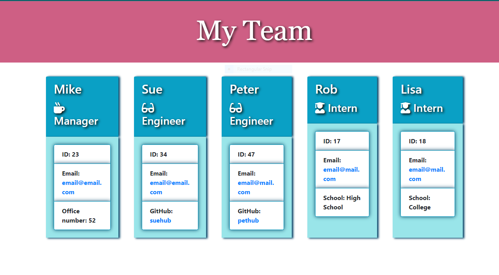

## Team Profile Generator
# TeamGen-OOP

**Description**

This command-line application is designed to generate an HTML webpage that displays basic information about employees. It prompts the user to enter information about the team manager, engineers, and interns, and then generates an HTML page with their details.

**Table of Contents**

    Installation
    Usage
    Credits
    License

**Installation**

To install and run the application, follow these steps:
Clone the repository to your local machine.
Navigate to the project directory in your terminal.
Run npm install to install the necessary dependencies.

    Clone the repository to your local machine.
    Navigate to the project directory in your terminal.
    Run npm install to install the necessary dependencies.

**Usage**

Once the application is installed, you can run it using the following command:
node index.js
Follow the prompts to enter information about employees. You will need to provide details such as name, ID, email, and specific information depending on the role (e.g., office number for managers, GitHub username for engineers, school for interns). Once you have entered information, the application will generate an HTML file named team.html in the output folder.

**Credits**

  This application was created as part of a coding challenge.

**License**

  This project is licensed under the MIT License. See the LICENSE file for details.

* Github link: https://github.com/RusLena/TeamGen-OOP.git

* Web App img: 

